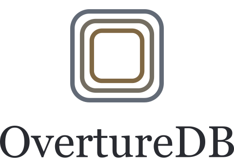

<!-- prettier-ignore -->

<picture>
  <source media="(prefers-color-scheme: dark)" srcset="../docs/brand/overturedb-logo-stacked-dark.svg" />
  
</picture>

 

*Community-curated artwork and theme music catalog for [Overture](https://github.com/AutoGitr/Overture)*

## Overview

OvertureDB provides consistent posters, backgrounds, and theme music for your media library. The public catalog stores curated selections as metadata, image URLs, and YouTube IDs for Overture to match against your movies and shows. The catalog validates and publishes to GitHub Pages after relevant merges, with a daily fallback.

## Highlights

- **Visual consistency**: Matching poster sets across franchises, select studios, people, and TV seasons.
- **Real background scenes**: Genuine shots from the movie or show - no "photoshopped" character collages or floating heads.
- **Criterion artwork**: Authentic, modern-formatted Criterion posters for films distributed by Criterion.
- **Curated themes**: Theme music for movies and shows without dialogue intros, YouTube promos, or watermarks.
- **Guided contributions**: Filter for incomplete catalog items in Overture, move through your selections, and submit a prefilled GitHub issue.
- **Built-in artwork checks**: Overture checks image formats, dimensions, aspect ratios, and source URLs to help your selections meet catalog requirements.

## Catalog at a glance

<!-- prettier-ignore -->
<a href="https://autogitr.github.io/OvertureDB/stats.json">
  <picture>
    <source media="(prefers-color-scheme: dark)" srcset="https://autogitr.github.io/OvertureDB/stats-dark.svg" />
    
  </picture>
</a>

Want to help fill the gaps? Read the [Selection Guidelines](../docs/selection-guidelines.md) to get started.
