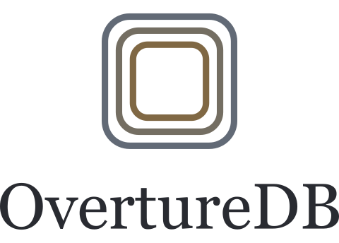

<picture>
  <source media="(prefers-color-scheme: dark)" srcset="../docs/brand/overturedb-logo-stacked-dark.svg" />
  
</picture>

 

*A hand-picked artwork and theme music catalog for [Overture](https://github.com/AutoGitr/Overture)*

[Use with Overture](#use-with-overture) • [Contribute selections](#contribute-selections)

## Why OvertureDB?

Every poster, background and season poster in OvertureDB was chosen by a contributor and approved by a maintainer, following the [selection guidelines](../docs/selection-guidelines.md). With Overture, you can use all of them in just a few clicks in your own media server library and get:

- **Posters** selected based on their design design and how accurately they represent the movie or show.
- **Backgrounds** that capture the look of the movie or show with a real scene from it, never a photoshopped collage of characters or floating heads.
- **Season posters** that belong together, so a show's seasons look like one set.
- **Posters** and **Backgrounds** that are visually distinct from each other for every movie and show.
- **Themes** that sound like an opening: music from the first second, with no dialogue intros, promotions or watermarks. They are picked and reviewed the same way, with ThemerrDB's themes available as an alternative.
- **Consistent sets**, so franchises, select studios and documentary series look and feel cohesive in your library.
- **Criterion releases** with their authentic Criterion cover art.

Accepted picks are available for anyone to use, so a title only has to be chosen once.

The catalog stores metadata, links to artwork on TMDB, ThePosterDB, Fanart.tv, TheTVDB and Plex, and YouTube IDs for themes. It does not host image or audio files.

<a href="https://autogitr.github.io/OvertureDB/">
  <picture>
    <source media="(prefers-color-scheme: dark)" srcset="https://autogitr.github.io/OvertureDB/stats-dark.svg" />
    
  </picture>
</a>

## Use with Overture

In Overture, open the menu in the header, choose **OvertureDB**, check **Enable OvertureDB** and click **Save**. Overture downloads the catalog, keeps it up to date and offers its selections next to your media server's artwork, ready to save to your library.

## Contribute selections

1. In Overture, set the **OvertureDB Status** filter to **Incomplete** to find titles that still need selections.
2. Choose artwork and a theme. Overture checks image formats, dimensions and links against the catalog rules.
3. Click the GitHub button on the title to open a prefilled issue, review it and submit it.

To submit many titles at once, use **OvertureDB -> Export selections** and attach the ZIP to a [bulk contribution](https://github.com/AutoGitr/OvertureDB/issues/new?template=bulk.yml). You can also fill in the [movie](https://github.com/AutoGitr/OvertureDB/issues/new?template=movie.yml) or [show](https://github.com/AutoGitr/OvertureDB/issues/new?template=show.yml) form yourself. A maintainer reviews every submission before it is published.

Coverage grows with contributions, and linked artwork or videos can disappear from their sources. Report wrong IDs, dead links or removal requests with the [correction form](https://github.com/AutoGitr/OvertureDB/issues/new?template=correction.yml).

## License

[BSD 3-Clause](../LICENSE). Theme mappings partly derive from ThemerrDB; see the [third-party notices](../licenses/THIRD_PARTY_NOTICES.md). Report security issues [privately](SECURITY.md).
